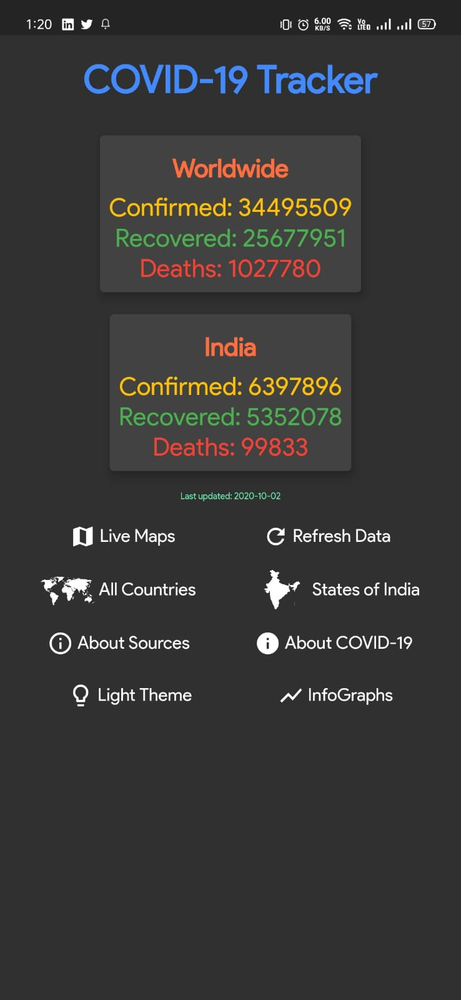
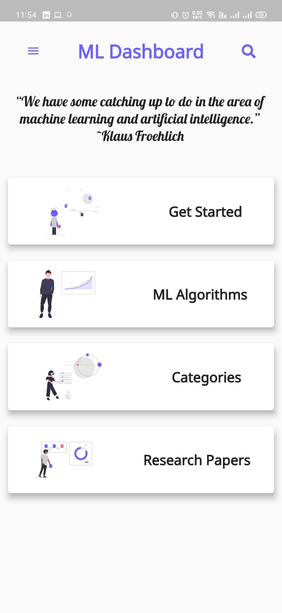

<h1 align="center">Awesome Flutter Art</h1>

  

 
  

  

A curated list of awesome Flutter artwork 🤩.

The repo contains awesome creations made using an awesome UI framework **Flutter** 💙 like Single Page UIs/Multipage UIs/Cool and innovative animations. All the contributions are made by some enthusiastic and innovative Flutter Devs.

Read the [CONTRIBUTING.md](https://github.com/clubgamma/Awesome-Flutter-Art/blob/master/CONTRIBUTING.md) to start your open source contribution.

# Art-Work

| Art💖                                                                                                                                  | Code📃                                                                                                             | Artist😎                                               |
| -------------------------------------------------------------------------------------------------------------------------------------- | ------------------------------------------------------------------------------------------------------------------ | ------------------------------------------------------ |
|                    | [Find the code here](https://github.com/clubgamma/Awesome-Flutter-Art/blob/master/yashpaneliya/main.dart)          | [Yash Paneliya](https://github.com/yashpaneliya)       |
|   | [Find the code here](https://github.com/Shubham-2007/Awesome-Flutter-Art/blob/master/Shubham-2007/time_clock)      | [Shubham Mendapara](https://github.com/Shubham-2007)   |
|                                           | [Find the code here](https://github.com/smit4297/Awesome-Flutter-Art/blob/master/smitpatel/login.dart)             | [Smit Patel](https://github.com/smit4297)              |
|   | [Find the code here](https://github.com/Shubham-2007/Awesome-Flutter-Art/blob/master/Shubham-2007/loginUI)         | [Shubham Mendapara](https://github.com/Shubham-2007)   |
|  | [Find the code here](https://github.com/Shubham-2007/Awesome-Flutter-Art/blob/master/Shubham-2007/custom_clock)    | [Shubham Mendapara](https://github.com/Shubham-2007)   |
|   | [Find the code here](https://github.com/Shubham-2007/Awesome-Flutter-Art/blob/master/Shubham-2007/car_demo)        | [Shubham Mendapara](https://github.com/Shubham-2007)   |
|   | [Find the code here](https://github.com/krish-pabani/Awesome-Flutter-Art/blob/master/krish-pabani/categories_card) | [Krish Pabani](https://github.com/krish-pabani)        |
|                   | [Find the code here](https://github.com/jerry2501/Awesome-Flutter-Art/blob/master/jerry2501/main.dart)             | [Jignesh Kukadiya](https://github.com/jerry2501)       |
|                                                                            | [Find the code here](https://github.com/madhavtripathi05/COVID_19_TRACKER)                                         | [Madhav Tripathi](https://github.com/madhavtripathi05) |
|                                                                              | [Find the code here](https://github.com/madhavtripathi05/ml_examples)                                              | [Madhav Tripathi](https://github.com/madhavtripathi05) |
|  | [Find the code here](https://github.com/tanharpatel/Awesome-Flutter-Art/blob/master/tanharpatel/main.dart) | [Tanha Patel](https://github.com/tanharpatel) |
|  | [Find the code here](https://github.com/AbhishekDoshi26/Awesome-Flutter-Art/blob/master/AbhishekDoshi26/main.dart) | [Abhishek Doshi](https://github.com/AbhishekDoshi26) |
|  | [Find the code here](https://github.com/AbhishekDoshi26/Awesome-Flutter-Art/blob/master/AbhishekDoshi26/main_wallpaper.dart) | [Abhishek Doshi](https://github.com/AbhishekDoshi26) |
|  | [Find the code here](https://github.com/AbhishekDoshi26/Awesome-Flutter-Art/blob/master/AbhishekDoshi26/main_whatsappdm.dart) | [Abhishek Doshi](https://github.com/AbhishekDoshi26) |
|  | [Find the code here](https://github.com/tanharpatel/Awesome-Flutter-Art/blob/master/tanharpatel/AnimatedIntro.dart) | [Tanha Patel](https://github.com/tanharpatel) |
|  | [Find the code here](https://github.com/hutomosaktikartiko/Awesome-Flutter-Art/blob/master/hutomosaktikartiko/ripple_animation.dart) | [Hutomo Sakti Kartiko](https://github.com/hutomosaktikartiko) |

# Things to keep in mind

- **Before creating any Pull Request, please register yourself at [Hacktoberfest's Official Website](https://hacktoberfest.digitalocean.com/)**
- **Club Gamma swags will only be shipped inside India**
- **If a maintainer reports behavior that’s not in line with the project’s code of conduct, then you will be ineligible to participate.**
- **Only first 30 contributors who successfully submit minimum 3 PRs to any of the projects in Club Gamma organization will get Club Gamma swags**
- **To get Digital Ocean swags, you just have to make minimum 4 PRs to any open source projects on GitHub**
- **If a maintainer reports your pull request as spam, it will not be counted towards your participation in Hacktoberfest.**

## Contact Us

**To know more about us, visit [official website](https://clubgamma.github.io/) of Club Gamma.**

**To know more about how Club Gamma is going to celebrate Hacktoberfest, click [here](https://clubgamma.github.io/hacktoberfest/)**

 

  
<i>If you want to add any feature or if you found a bug, feel free to open an issue</i>  

 
 
 

